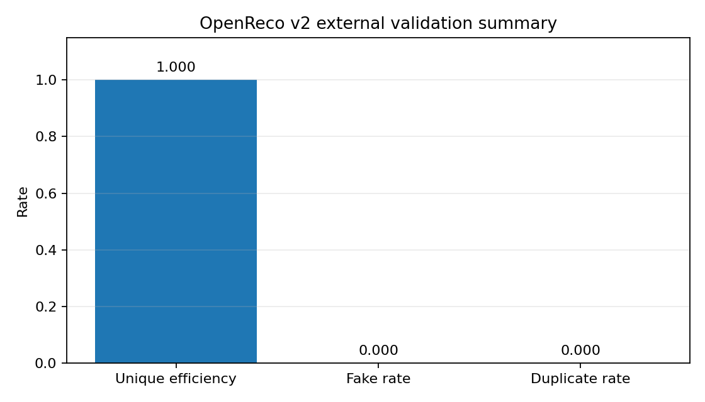
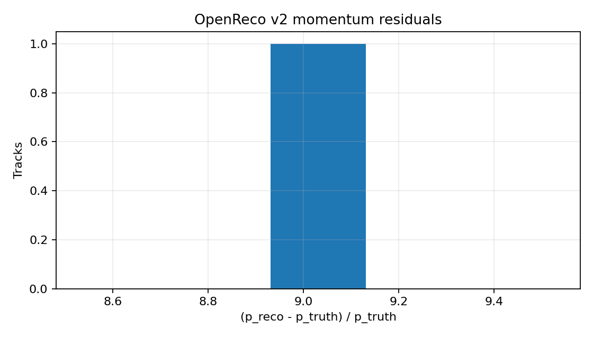

# OpenReco: Open-Source Particle Track Reconstruction Framework

OpenReco is a compact open-source charged-particle track reconstruction prototype written in Python.

It started as a v0 single-track Kalman-filter core, grew into a v1 event-level reconstruction chain, and now includes a v2 external validation interface for ACTS-style and official ACTS/Fatras GenericDetector CSV outputs.

OpenReco is not intended to reproduce a full experiment framework. The goal is to build the smallest serious reconstruction chain that exposes the core problems found in real high-energy physics tracking software:

```text
state parameterization
surface measurements
magnetic-field propagation
track seeding
track finding
track fitting
smoothing
holes and missing measurements
fake and duplicate tracks
truth matching
external validation
```

The implementation is deliberately compact and Python-based so that the mathematics and reconstruction logic can be studied, debugged, and extended before moving toward more realistic detector descriptions, full ACTS comparisons, ODD samples, Geant4-compatible hit interfaces, or CMS Open Data.

---

## Current status: v2.0 external validation complete

OpenReco v2.0 extends the project beyond internally generated toy events by adding a file-based external validation interface.

The v2 chain supports:

```text
ACTS-style CSV loading
official ACTS/Fatras GenericDetector CSV loading
external truth-particle parsing
external hit/measurement parsing
adapter into OpenReco barrel measurement objects
v1 seeding and track finding on external events
EKF-style fitting and smoothing
truth matching
fake-track and duplicate-track counting
unique-truth tracking efficiency
momentum residual validation
CSV report output
validation plots
```

The key v2 pipeline is:

```text
external ACTS/Fatras CSV files
→ OpenReco external loader
→ OpenReco adapter
→ triplet seeding
→ greedy track finding
→ EKF-style track fitting
→ truth matching
→ validation metrics
→ CSV reports and plots
```

This is not a full ACTS C++ integration. OpenReco does not call the ACTS runtime. Instead, v2 proves that OpenReco can ingest external reconstruction-style tracking data and validate itself using standard tracking metrics.

---

## v2.0 official ACTS/Fatras validation result

The official ACTS/Fatras GenericDetector sample was loaded from:

```text
datasets/acts_fatras_sample/
  event000000000-hits.csv
  event000000000-particles_initial.csv
  event000000000-particles_final.csv
```

Run:

```powershell
python examples/acts_dataset_validation.py --dataset datasets/acts_fatras_sample --input-format acts-fatras
```

Calibrated v2 result:

```text
events processed:             1
truth particles:              1
reconstructed tracks:         1
matched tracks:               1
unique matched truth:         1
fake tracks:                  0
duplicate tracks:             0

unique tracking efficiency:   1.000
raw matched-track efficiency: 1.000
fake rate:                    0.000
duplicate rate:               0.000
mean chi2/ndof:               0.077
covariance valid rate:        1.000
momentum rel residual:        mean=-0.0031, std=0.0000
```

The default ACTS/Fatras loader uses:

```text
length_scale = 0.1
radius_merge_tolerance = 0.5
```

This maps mm-like ACTS hit coordinates into the smaller OpenReco toy geometry scale and groups ACTS surfaces into simplified cylindrical radius shells.

---

## v2.0 report outputs

Running the external validation example writes:

```text
docs/v2_external_validation_summary.csv
docs/v2_external_validation_tracks.csv
docs/images/v2_efficiency_summary.png
docs/images/v2_momentum_residuals.png
```

The summary CSV contains event-level validation quantities.

The track CSV contains per-track quantities including:

```text
event id
track id
matched truth particle id
matched fraction
fake flag
duplicate flag
chi2/ndof
q/p
p estimate
truth momentum
momentum residual
covariance validity
number of holes
fit status
```

---

## v2.0 plots

### External validation summary



### Momentum residuals



---

## v2.0 input formats

OpenReco v2 supports two external input modes.

### 1. Simple ACTS-style CSV format

Directory structure:

```text
datasets/acts_small/
  truth_particles.csv
  measurements.csv
```

Run:

```powershell
python examples/acts_dataset_validation.py --dataset datasets/acts_small --input-format acts-style
```

Expected files:

```text
truth_particles.csv
measurements.csv
```

The simple format is useful for controlled tests and reproducible toy external samples.

### 2. Official ACTS/Fatras GenericDetector CSV format

Directory structure:

```text
datasets/acts_fatras_sample/
  event000000000-hits.csv
  event000000000-particles_initial.csv
  event000000000-particles_final.csv
```

Run:

```powershell
python examples/acts_dataset_validation.py --dataset datasets/acts_fatras_sample --input-format acts-fatras
```

Optional calibration parameters:

```powershell
python examples/acts_dataset_validation.py --dataset datasets/acts_fatras_sample --input-format acts-fatras --fatras-length-scale 0.1 --fatras-radius-merge-tolerance 0.5
```

---

## Quick start

Install dependencies:

```powershell
pip install -r requirements.txt
```

Run all tests:

```powershell
python -m pytest
```

Current full test status:

```text
254 passed
```

Run the v2 ACTS/Fatras validation example:

```powershell
python examples/acts_dataset_validation.py --dataset datasets/acts_fatras_sample --input-format acts-fatras
```

Run the simple ACTS-style validation example:

```powershell
python examples/acts_dataset_validation.py --dataset datasets/acts_small --input-format acts-style
```

Run the internally generated ACTS-style Stage-B dataset example:

```powershell
python -m openreco.external.acts_export --output datasets/acts_openreco_generated --n-events 5 --n-particles 5 --noise-hits-per-layer 1
python examples/acts_dataset_validation.py --dataset datasets/acts_openreco_generated --input-format acts-style
```

---

## Repository structure

```text
openreco/
  __init__.py
  diagnostics.py
  event_generation.py
  field.py
  geometry.py
  kalman.py
  measurements.py
  particle_gun.py
  propagation.py
  seeding.py
  smoothing.py
  state.py
  track_finding.py
  track_fitting.py
  truth_matching.py
  visualization.py

openreco/external/
  __init__.py
  acts_adapter.py
  acts_export.py
  acts_fatras_loader.py
  acts_loader.py
  acts_schema.py
  reconstruction.py

openreco/validation/
  __init__.py
  external_metrics.py
  report.py

examples/
  acts_dataset_validation.py
  multi_event_validation.py
  multi_track_reconstruction.py
  single_track_straight_line.py
  single_track_uniform_B.py
  v1_performance_scan.py

datasets/
  acts_small/
  acts_openreco_generated/
  acts_fatras_sample/

docs/
  images/
  v2_external_validation_summary.csv
  v2_external_validation_tracks.csv

tests/
  test_acts_adapter.py
  test_acts_dataset_end_to_end.py
  test_acts_export.py
  test_acts_fatras_loader.py
  test_acts_loader.py
  test_acts_validation_metrics.py
  test_diagnostics.py
  test_end_to_end.py
  test_event_generation.py
  test_field.py
  test_geometry.py
  test_hole_aware_tracking.py
  test_kalman.py
  test_measurements.py
  test_multi_track_reconstruction.py
  test_particle_gun.py
  test_propagation.py
  test_seeding.py
  test_smoothing.py
  test_state.py
  test_track_finding.py
  test_track_fitting.py
  test_truth_matching.py
  test_v1_performance_scan.py
  test_visualization.py
```

---

## v2.0 components

### External schema

`openreco/external/acts_schema.py` defines compact dataclasses for:

```text
ActsTruthParticle
ActsMeasurement
ActsEvent
ActsDataset
```

These provide a stable internal representation for external tracking datasets.

### Simple ACTS-style loader

`openreco/external/acts_loader.py` reads:

```text
truth_particles.csv
measurements.csv
```

It validates required columns, angle conventions, radius consistency, and measurement uncertainties.

### Official ACTS/Fatras loader

`openreco/external/acts_fatras_loader.py` reads official ACTS/Fatras GenericDetector CSV output:

```text
eventXXXXXXXXX-particles_initial.csv
eventXXXXXXXXX-hits.csv
```

It maps ACTS hit positions and truth particle labels into OpenReco’s simplified external event schema.

### Adapter

`openreco/external/acts_adapter.py` converts external events into OpenReco-compatible barrel detector layers and cylindrical measurements.

The adapter maps:

```text
x, y, z
→ r, phi, z
→ OpenReco Measurement([phi, z], covariance)
```

### External reconstruction runner

`openreco/external/reconstruction.py` runs the existing v1 reconstruction chain on converted external events:

```text
seeding
track finding
EKF fitting
smoothing
truth matching
```

### Validation metrics and reports

`openreco/validation/external_metrics.py` and `openreco/validation/report.py` compute and write:

```text
unique tracking efficiency
raw matched-track efficiency
fake rate
duplicate rate
mean chi2/ndof
covariance valid rate
momentum residual mean/std
runtime/event
CSV summaries
validation plots
```

Unique tracking efficiency is defined as:

```text
unique matched truth particles / total truth particles
```

This avoids unphysical efficiencies above 1 when duplicate tracks are reconstructed.

---

## v1 event-level reconstruction

OpenReco v1 turns the v0 single-track core into a small event reconstruction chain:

```text
multi-particle event generation
mixed cylindrical detector hits
triplet seed building
hole-aware seed building
greedy track finding
shared-hit rejection
EKF-style track fitting
RTS-style smoothing
truth matching
efficiency, fake-rate, duplicate-rate, chi-square, covariance, and momentum validation
```

Example v1 demo:

```powershell
python examples/multi_track_reconstruction.py
```

Example v1 result:

```text
truth particles:        5
measurements:           36
real measurements:      30
noise measurements:     6
seeds built:            216
reconstructed tracks:   5
matched tracks:         5
fake tracks:            0
duplicate tracks:       0

tracking efficiency:    1.000
fake rate:              0.000
duplicate rate:         0.000
mean chi2/ndof:         0.861
covariance valid rate:  1.000
momentum rel error:     mean=-0.0177, std=0.0556
plot saved:             docs/images/v1_multi_track_event.png
```


---

## v0 single-track tracking core

OpenReco v0 is the single-track Kalman-filter core that v1 and v2 build on.

The v0 chain is:

```text
particle gun
→ uniform magnetic field
→ cylindrical detector layers
→ smeared surface measurements
→ truth-assisted seed
→ bound-state EKF-style prediction/update
→ RTS-style smoothing
→ residuals, pulls, chi-square, momentum estimate, uncertainty estimate
```

OpenReco uses a five-parameter bound state on a reference surface:

```text
[loc0, loc1, dir0, dir1, q_over_p]
```

For cylindrical detector layers, this becomes:

```text
[phi, z, alpha, tan_lambda, q_over_p]
```

Run:

```powershell
python examples/single_track_uniform_B.py
```

Example v0 result:

```text
Number of cylindrical layers: 6
Layer radii: [10. 20. 30. 40. 50. 60.]

truth p  = 2.8395
fitted p = 2.9712 ± 0.1582
total chi2 = 4.4334
covariance valid = True
```

---

## Current limitations

OpenReco v2.0 is still a compact reconstruction prototype. It does not yet include:

```text
full ACTS C++ runtime integration
Geant4 hit interface
ODD full-chain validation
CMS Open Data validation
vertexing
full ambiguity resolution
full combinatorial Kalman filter
realistic detector material
multiple scattering model
energy loss model
detector misalignment
DD4hep or TGeo geometry import
GPU acceleration
machine-learning-based tracking
```

The current ACTS/Fatras importer uses a simplified cylindrical radius-shell mapping. It is sufficient for the v2.0 external validation milestone, but it is not yet a full detector-geometry translation.

---

## Roadmap after v2.0

Recommended next steps:

```text
1. Improve uncertainty calibration so pull widths approach 1.
2. Add stronger ambiguity resolution for duplicate-track suppression.
3. Add configurable material/process-noise studies.
4. Add multiple-scattering and energy-loss effects.
5. Compare against larger ACTS/Fatras GenericDetector samples.
6. Add optional ACTS reference-track comparison if exported tracks are available.
7. Move to ODD-style full-chain samples.
8. Add a Geant4-compatible hit/truth interface in v3.0.
9. Later validate against CMS Open Data.
10. Eventually explore CKF-style branching, GPU acceleration, and ML-based tracking.
```

---

## What OpenReco is

OpenReco is a minimal reconstruction learning and prototyping framework. It is not a full detector framework.

Its value is that it already contains a compact but complete reconstruction loop:

```text
external or generated events
surface-bound state
surface measurements
triplet seeding
track following
prediction
update
smoothing
truth matching
holes
fake-rate validation
duplicate-rate validation
momentum estimate
uncertainty estimate
CSV reporting
validation plots
```

The main remaining limitations are calibration, material realism, ambiguity resolution, and larger-scale validation against external truth datasets.

---

## References and inspiration

OpenReco is inspired by standard charged-particle track reconstruction theory and modern tracking software architecture.

* R. Frühwirth, *Track and Vertex Fitting*
  Theory reference for track states, covariance matrices, measurement errors, Kalman filtering, smoothing, residuals, pulls, and uncertainty validation.
  https://cds.cern.ch/record/340476/files/p217.pdf

* ACTS Collaboration, *A Common Tracking Software Project*
  Architecture reference for surface-based geometry, bound track parameters, propagation, triplet seeding, track fitting, hole handling, truth matching, fake-rate validation, duplicate-rate validation, and scalable event reconstruction workflows.
  https://doi.org/10.1007/s41781-021-00078-8

* ACTS GitHub Repository
  Open-source tracking software project used as an architectural reference and source of the official ACTS/Fatras GenericDetector CSV sample used for v2 external validation.
  https://github.com/acts-project/acts
