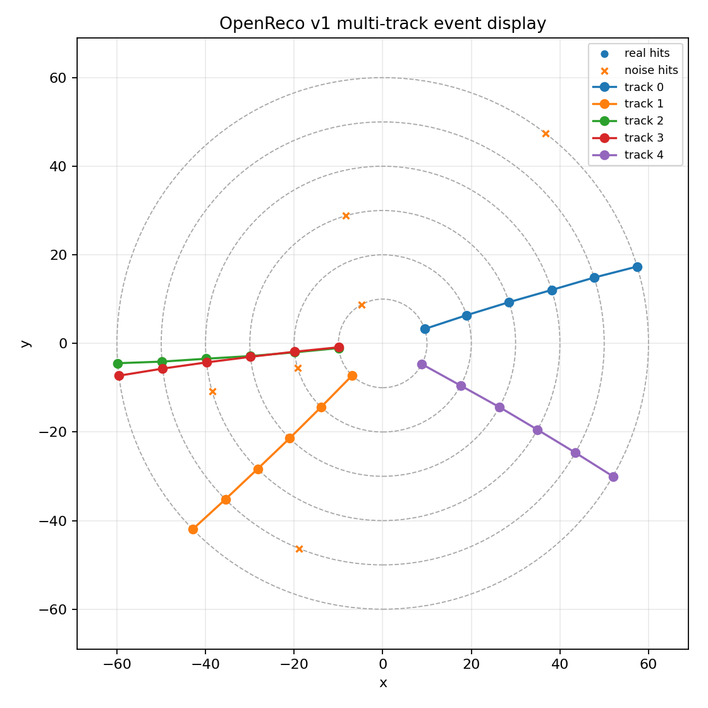
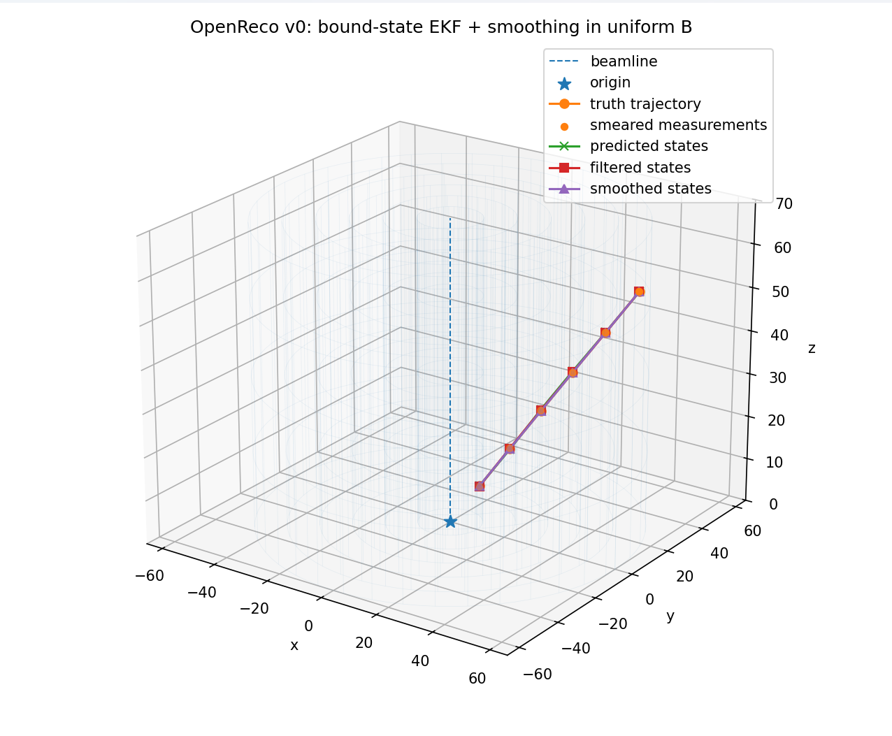
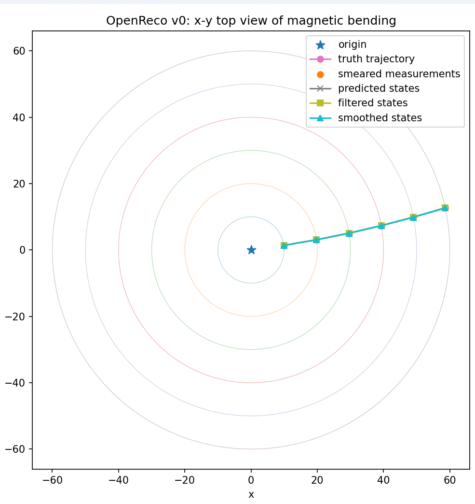

# OpenReco: Open-Source Particle Track Reconstruction Framework

OpenReco is a compact open-source charged-particle track reconstruction prototype written in Python.

The project started as a **v0 single-track Kalman-filter core**, grew into a **v1 event-level reconstruction prototype**, and now includes a **v2 external validation interface** for ACTS-style and official ACTS/Fatras GenericDetector CSV outputs.

OpenReco is not intended to reproduce a full experiment framework yet. The goal is to build the smallest serious reconstruction chain that exposes the same core problems found in real high-energy physics tracking software:

```text
state parameterization
surface measurements
magnetic-field propagation
track seeding
track finding
track fitting
smoothing
holes and missing measurements
fake and duplicate tracks
truth matching
external validation
```

The implementation is deliberately compact and Python-based so that the mathematics and reconstruction logic can be studied, debugged, and extended before moving toward more realistic detector descriptions, full ACTS comparisons, ODD samples, Geant4-compatible hit interfaces, or CMS Open Data.

---

## Current status: v2 external validation complete

OpenReco has now reached **v2.0 external validation**.

v2 adds a file-based validation interface for:

```text
simple ACTS-style CSV datasets
official ACTS/Fatras GenericDetector CSV output
```

The v2 external validation chain is:

```text
external ACTS/Fatras CSV files
→ OpenReco external loader
→ OpenReco adapter
→ triplet seeding
→ greedy track finding
→ EKF-style track fitting
→ truth matching
→ validation metrics
→ CSV reports and plots
```

This is **not** a full ACTS C++ runtime integration. OpenReco does not call ACTS internally. Instead, v2 proves that OpenReco can ingest external ACTS/Fatras CSV output and run its own reconstruction and validation pipeline on truth-labeled tracking data.

Official ACTS/Fatras calibrated validation result:

```text
events processed:             1
truth particles:              1
reconstructed tracks:         1
matched tracks:               1
unique matched truth:         1
fake tracks:                  0
duplicate tracks:             0

unique tracking efficiency:   1.000
raw matched-track efficiency: 1.000
fake rate:                    0.000
duplicate rate:               0.000
mean chi2/ndof:               0.077
covariance valid rate:        1.000
momentum rel residual:        mean=-0.0031, std=0.0000
```

Run the official ACTS/Fatras validation example:

```powershell
python examples/acts_dataset_validation.py --dataset datasets/acts_fatras_sample --input-format acts-fatras
```

The v2 validation report writes:

```text
docs/v2_external_validation_summary.csv
docs/v2_external_validation_tracks.csv
docs/images/v2_efficiency_summary.png
docs/images/v2_momentum_residuals.png
```

### v2 ACTS/Fatras smoke-test note

The validation plots are generated automatically, but they are not highlighted here because the current official ACTS/Fatras sample contains only one reconstructed track. A larger ACTS/Fatras sample is needed before the residual histogram becomes visually meaningful.

Current full test suite:

```text
254 passed
```
### v2.1 evidence report

The v2.1 evidence-consolidation report is available at:

`docs/reports/v2_1_evidence/OpenReco_v0_to_v2_validation_report.md`

Supporting v2.1 evidence files:

`docs/reports/v2_1_evidence/validation_summary_table.csv`

`docs/reports/v2_1_evidence/scope_and_limitations.md`

v2.1 does not add new reconstruction algorithms. It consolidates the v0, v1, and v2 validation evidence, clarifies the project scope, and prepares OpenReco for controlled tracking-performance studies.

---

## v2 input formats

OpenReco v2 supports two external input modes.

### 1. Simple ACTS-style CSV format

Directory structure:

```text
datasets/acts_small/
  truth_particles.csv
  measurements.csv
```

Run:

```powershell
python examples/acts_dataset_validation.py --dataset datasets/acts_small --input-format acts-style
```

This format is useful for controlled tests and reproducible toy external samples.

### 2. Official ACTS/Fatras GenericDetector CSV format

Directory structure:

```text
datasets/acts_fatras_sample/
  event000000000-hits.csv
  event000000000-particles_initial.csv
  event000000000-particles_final.csv
```

Run:

```powershell
python examples/acts_dataset_validation.py --dataset datasets/acts_fatras_sample --input-format acts-fatras
```

Optional ACTS/Fatras calibration parameters:

```powershell
python examples/acts_dataset_validation.py --dataset datasets/acts_fatras_sample --input-format acts-fatras --fatras-length-scale 0.1 --fatras-radius-merge-tolerance 0.5
```

The default `fatras-length-scale=0.1` maps mm-like ACTS coordinates into OpenReco’s smaller toy detector scale.

---

## v2 components

OpenReco v2 adds the following modules:

```text
openreco/external/acts_schema.py
openreco/external/acts_loader.py
openreco/external/acts_fatras_loader.py
openreco/external/acts_adapter.py
openreco/external/acts_export.py
openreco/external/reconstruction.py
openreco/validation/external_metrics.py
openreco/validation/report.py
```

### External schema

`openreco/external/acts_schema.py` defines compact dataclasses for:

```text
ActsTruthParticle
ActsMeasurement
ActsEvent
ActsDataset
```

These provide a stable internal representation for external tracking datasets.

### Simple ACTS-style loader

`openreco/external/acts_loader.py` reads:

```text
truth_particles.csv
measurements.csv
```

It validates required columns, angle conventions, radius consistency, and measurement uncertainties.

### Official ACTS/Fatras loader

`openreco/external/acts_fatras_loader.py` reads official ACTS/Fatras GenericDetector CSV output:

```text
eventXXXXXXXXX-particles_initial.csv
eventXXXXXXXXX-hits.csv
```

It maps ACTS hit positions and truth particle labels into OpenReco’s simplified external event schema.

### Adapter

`openreco/external/acts_adapter.py` converts external events into OpenReco-compatible barrel detector layers and cylindrical measurements.

The adapter maps:

```text
x, y, z
→ r, phi, z
→ OpenReco Measurement([phi, z], covariance)
```

### External reconstruction runner

`openreco/external/reconstruction.py` runs the existing v1 reconstruction chain on converted external events:

```text
seeding
track finding
EKF fitting
smoothing
truth matching
```

### Validation metrics and reports

`openreco/validation/external_metrics.py` and `openreco/validation/report.py` compute and write:

```text
unique tracking efficiency
raw matched-track efficiency
fake rate
duplicate rate
mean chi2/ndof
covariance valid rate
momentum residual mean/std
runtime/event
CSV summaries
validation plots
```

Unique tracking efficiency is defined as:

```text
unique matched truth particles / total truth particles
```

This avoids unphysical efficiencies above 1 when duplicate tracks are reconstructed.

---

## Quick start

Install dependencies:

```powershell
pip install -r requirements.txt
```

Run all tests:

```powershell
python -m pytest
```

Current result:

```text
254 passed
```

Run the v2 official ACTS/Fatras validation example:

```powershell
python examples/acts_dataset_validation.py --dataset datasets/acts_fatras_sample --input-format acts-fatras
```

Run the simple ACTS-style validation example:

```powershell
python examples/acts_dataset_validation.py --dataset datasets/acts_small --input-format acts-style
```

Run the v1 multi-track demo:

```powershell
python examples/multi_track_reconstruction.py
```

Run the v1 performance scan:

```powershell
python examples/v1_performance_scan.py
```

Run the v0 single-track uniform-B demo:

```powershell
python examples/single_track_uniform_B.py
```

---

## Repository structure

```text
openreco/
  __init__.py
  diagnostics.py
  event_generation.py
  field.py
  geometry.py
  kalman.py
  measurements.py
  particle_gun.py
  propagation.py
  seeding.py
  smoothing.py
  state.py
  track_finding.py
  track_fitting.py
  truth_matching.py
  visualization.py

openreco/external/
  __init__.py
  acts_adapter.py
  acts_export.py
  acts_fatras_loader.py
  acts_loader.py
  acts_schema.py
  reconstruction.py

openreco/validation/
  __init__.py
  external_metrics.py
  report.py

examples/
  acts_dataset_validation.py
  multi_event_validation.py
  multi_track_reconstruction.py
  single_track_straight_line.py
  single_track_uniform_B.py
  v1_performance_scan.py

datasets/
  acts_small/
  acts_openreco_generated/
  acts_fatras_sample/

docs/
  images/
  v2_external_validation_summary.csv
  v2_external_validation_tracks.csv

tests/
  test_acts_adapter.py
  test_acts_dataset_end_to_end.py
  test_acts_export.py
  test_acts_fatras_loader.py
  test_acts_loader.py
  test_acts_validation_metrics.py
  test_diagnostics.py
  test_end_to_end.py
  test_event_generation.py
  test_field.py
  test_geometry.py
  test_hole_aware_tracking.py
  test_kalman.py
  test_measurements.py
  test_multi_track_reconstruction.py
  test_particle_gun.py
  test_propagation.py
  test_seeding.py
  test_smoothing.py
  test_state.py
  test_track_finding.py
  test_track_fitting.py
  test_truth_matching.py
  test_v1_performance_scan.py
  test_visualization.py
```

---

## Previous milestone: v1 event-level reconstruction complete

OpenReco v1 turns the v0 single-track core into a small event reconstruction chain.

The v1 reconstruction chain is:

```text
multi-particle event generation
→ mixed cylindrical detector hits
→ triplet seed building
→ greedy track finding
→ EKF-style track fitting
→ RTS-style smoothing
→ truth matching
→ efficiency, fake-rate, duplicate-rate, chi-square, covariance, and momentum validation
```

OpenReco v1 includes:

```text
multi-particle event generation
simple cylindrical barrel detector
truth-labeled and noise hits
mixed detector measurements grouped by layer
triplet seed construction
hole-aware seed construction from multiple layer triplets
greedy track finding
shared-hit rejection
EKF fitting using the v0 cylindrical Kalman core
RTS-style smoothing
truth matching
fake-track counting
duplicate-track counting
hole counting
track quality cuts
covariance validity checks
momentum residual validation
performance scan CSV output
2D event visualization
```

---

## v1 final validation

The final v1 validation was run with:

```text
events:                200
truth particles/event: 5
hit efficiency:        0.95
noise hits/layer:      1
minimum hits/track:    5
seed mode:             hole-aware
magnetic field:        uniform Bz
detector:              6 cylindrical barrel layers
```

Final validation result:

```text
tracking efficiency:    0.956
fake rate:              0.000
duplicate rate:         0.000
mean holes/track:       0.21
mean chi2/ndof:         0.992
covariance valid rate:  1.000
momentum residual mean: 0.0011
runtime/event:          2.0938 s
```

Interpretation:

```text
tracking efficiency is above the v1 target
fake rate is zero in this toy validation
duplicate rate is zero in this toy validation
covariance validity is stable
momentum residual mean is centered near zero
chi2/ndof is close to one
hole-aware tracking recovers most 5/6-hit tracks
```

The v1 chain is still a simplified reconstruction prototype. It does not include full ambiguity resolution, realistic detector material, multiple scattering, energy loss, detector misalignment, or a full combinatorial Kalman filter.

---

## v1 reconstruction chain

### 1. Event generation

The event generator creates multiple charged particles and propagates them through a simple cylindrical barrel detector.

Each generated hit stores:

```text
hit id
layer index
layer name
radius
phi
z
measurement covariance
truth particle id
noise flag
```

This allows reconstructed tracks to be compared directly to the generated truth particles.

### 2. Triplet seeding

The first v1 seed builder creates track candidates from three detector hits.

The strict mode uses the first three barrel layers:

```text
barrel_0, barrel_1, barrel_2
```

The hole-aware mode builds seeds from multiple three-layer combinations. This allows the reconstruction to recover tracks when one of the early layers is missing.

### 3. Track finding

Track finding starts from each triplet seed and greedily searches for compatible hits on the other detector layers.

The current track finder includes:

```text
simple phi(r), z(r) prediction model
chi-square compatibility test
shared-hit rejection
minimum hit requirement
hole counting
missing-layer bookkeeping
basic track quality cuts
```

This is intentionally not a full combinatorial Kalman filter yet. It is a minimal local track-following prototype.

### 4. EKF fitting and smoothing

Accepted v1 track candidates are passed to the existing v0 cylindrical EKF-style fitting core.

The fit performs:

```text
surface-to-surface prediction
numerical transport Jacobian
covariance propagation
2D local measurement update [phi, z]
chi-square calculation
RTS-style backward smoothing
covariance validation
momentum extraction
```

Tracks with invalid covariance, non-finite momentum, or extreme fitted chi-square are rejected by final quality cuts.

### 5. Truth matching and metrics

Each reconstructed track is matched to truth using the majority truth label among its hits.

A reconstructed track is treated as matched if at least half of its hits come from one truth particle.

The validation reports:

```text
tracking efficiency
fake rate
duplicate rate
mean hits per track
mean holes per track
mean chi2/ndof
covariance valid rate
momentum residual mean/std
runtime per event
```

---

## v1 demo

Run:

```powershell
python examples/multi_track_reconstruction.py
```

The demo:

```text
creates a multi-particle event
generates truth-labeled cylindrical hits
adds optional noise hits
builds triplet seeds
finds reconstructed track candidates
fits tracks with the EKF wrapper
smooths the fitted tracks
matches reconstructed tracks to truth
prints efficiency, fake rate, duplicate rate, chi-square, covariance validity, and momentum residuals
saves an x-y event display
```

Example v1 demo result after EKF integration:

```text
truth particles:        5
measurements:           36
real measurements:      30
noise measurements:     6
seeds built:            216
reconstructed tracks:   5
matched tracks:         5
fake tracks:            0
duplicate tracks:       0

tracking efficiency:    1.000
fake rate:              0.000
duplicate rate:         0.000
mean chi2/ndof:         0.861
covariance valid rate:  1.000
momentum rel error:     mean=-0.0177, std=0.0556
plot saved:             docs/images/v1_multi_track_event.png
```

---

## v1 demo plot



---

# v0 tracking core

OpenReco v0 is the single-track Kalman-filter core that v1 and v2 build on.

The v0 goal was to validate the smallest serious tracking loop:

```text
particle gun
→ uniform magnetic field
→ cylindrical detector layers
→ smeared surface measurements
→ truth-assisted seed
→ bound-state EKF-style prediction/update
→ RTS-style smoothing
→ residuals, pulls, chi-square, momentum estimate, uncertainty estimate
```

OpenReco v0 uses a simple cylindrical tracker and a homogeneous magnetic field along the beam axis. The main purpose was to debug the tracking mathematics before adding event-level pattern recognition.

---

## v0 core components

OpenReco v0 includes:

```text
5D surface-bound track state
5×5 covariance matrix
cylindrical detector layers
particle gun event source
uniform Bz magnetic field
smeared cylindrical measurements [phi, z]
truth-assisted seed
bound-state EKF-style prediction/update
2D local measurement update [phi, z]
RTS-style backward smoothing
residuals
Kalman pulls using residual covariance
chi-square summaries
momentum estimate
momentum uncertainty estimate
covariance validity checks
multi-event validation
3D and x-y visualization
```

---

## Core design

### Track state

OpenReco uses a five-parameter bound state on a reference surface:

```text
[loc0, loc1, dir0, dir1, q_over_p]
```

For cylindrical detector layers, this becomes:

```text
[phi, z, alpha, tan_lambda, q_over_p]
```

where:

```text
phi        = angular coordinate on the cylinder
z          = longitudinal coordinate
alpha      = transverse momentum direction angle
tan_lambda = pz / pt
q_over_p   = charge / momentum
```

Each state carries a 5×5 covariance matrix.

### Detector model

The current detector is a simple barrel tracker made from cylindrical layers:

```text
r = 10, 20, 30, 40, 50, 60
```

Each cylindrical layer can hold a local measurement:

```text
[phi, z]
```

The geometry is intentionally small so that the Kalman filter, covariance behavior, and event-level reconstruction logic can be debugged before adding detector complexity.

### Magnetic field, propagation, and prediction model

OpenReco uses a homogeneous magnetic field along z:

```text
B = [0, 0, Bz]
```

For a cylindrical bound state on layer `k`,

```text
x_k = [phi, z, alpha, tan_lambda, q_over_p]
```

OpenReco first converts the bound state into a free particle-like representation:

```text
p  = 1 / |q_over_p|
pt = p / sqrt(1 + tan_lambda²)
pz = pt * tan_lambda
px = pt * cos(alpha)
py = pt * sin(alpha)
```

The particle is then propagated in the transverse plane using a minimal helix-like model in a uniform `Bz` field.

The current unit convention is simplified and toy-consistent. More realistic HEP unit handling is future work.

### Measurements

Cylindrical hits are generated by smearing the truth intersection with Gaussian noise:

```text
measurement = [phi, z]
covariance  = diag([sigma_phi², sigma_z²])
```

The Kalman update uses both local coordinates, `phi` and `z`.

### Kalman filter

The EKF-style loop performs:

```text
prediction to next cylindrical layer
covariance propagation using numerical transport Jacobian
2D local measurement update with [phi, z]
chi-square calculation
residual covariance calculation
```

The measurement update is linear in the selected cylindrical bound coordinates:

```text
h(x) = [phi, z]
```

The update uses the local measurement matrix:

```text
H =
[1 0 0 0 0
 0 1 0 0 0]
```

because the bound state is:

```text
[phi, z, alpha, tan_lambda, q_over_p]
```

### Smoothing

OpenReco includes an RTS-style backward smoother.

For filtered state `k` and predicted state `k+1`, the smoother uses:

```text
A_k = C_k^f F_{k+1}ᵀ (C_{k+1}^-)⁻¹
```

and computes smoothed states and covariances by walking backward through the track.

---

## v0 single-track demo

Run:

```powershell
python examples/single_track_uniform_B.py
```

This demo:

```text
creates a cylindrical detector
creates a uniform Bz field
generates one charged particle
propagates truth to cylindrical layers
creates smeared [phi, z] measurements
builds a truth-assisted seed
runs bound-state EKF-style filtering
runs backward smoothing
prints residuals, pulls, chi-square, covariance validity
prints momentum estimate and uncertainty
shows a 3D event display
shows an x-y top view
```

Example output:

```text
OpenReco v0 uniform-B cylindrical demo
--------------------------------------
Number of cylindrical layers: 6
Layer radii: [10. 20. 30. 40. 50. 60.]

Momentum estimate from final smoothed state:
  truth p  = 2.8395
  fitted p = 2.9712 ± 0.1582
  abs err  = 0.1317
  rel err  = 0.0464

Fit quality:
  total chi2       = 4.4334
  n updates        = 6
  pull mean [φ,z]  = [-0.1866, -0.3720]
  pull std  [φ,z]  = [0.2134, 0.7220]
  covariance valid = True
```

---

## v0 demo plots

### 3D cylindrical barrel view



### x-y top view of magnetic bending



The single-event pull values are only a smoke test. Pull distributions need many events.

---

## v0 multi-event validation

Run:

```powershell
python examples/multi_event_validation.py
```

Current 200-event v0 validation result:

```text
events requested:       200
events successful:      200
success rate:           1.0000
covariance valid rate:  1.0000

Kalman pull summary:
  phi mean:              0.0041
  phi std:               0.6263
  z mean:               -0.0234
  z std:                 0.8287

Momentum error summary:
  abs error mean:        0.0074
  abs error std:         0.0882
  rel error mean:        0.0026
  rel error std:         0.0310
```

Interpretation:

```text
success rate is good
covariance validity is good
pull means are close to zero
pull widths are below 1
momentum error is small
```

The pull widths below 1 are a known v0 calibration issue, especially for `phi`.

---

## Running tests

Run the full test suite:

```powershell
python -m pytest
```

Current full result:

```text
254 passed
```

Run only the v2 external validation tests:

```powershell
python -m pytest tests/test_acts_loader.py tests/test_acts_adapter.py tests/test_acts_dataset_end_to_end.py tests/test_acts_export.py tests/test_acts_fatras_loader.py tests/test_acts_validation_metrics.py
```

Run the v1 validation tests:

```powershell
python -m pytest tests/test_event_generation.py tests/test_seeding.py tests/test_truth_matching.py tests/test_track_finding.py tests/test_multi_track_reconstruction.py tests/test_v1_performance_scan.py tests/test_track_fitting.py tests/test_hole_aware_tracking.py -q
```

Run the v0 core test suite:

```powershell
python -m pytest tests/test_state.py tests/test_geometry.py tests/test_measurements.py tests/test_field.py tests/test_particle_gun.py tests/test_propagation.py tests/test_kalman.py tests/test_diagnostics.py tests/test_visualization.py tests/test_smoothing.py tests/test_end_to_end.py
```

---

## Current limitations

OpenReco v2.0 is still a compact reconstruction prototype. It does not yet include:

```text
full ACTS C++ runtime integration
Geant4 hit interface
ODD full-chain validation
CMS Open Data validation
vertexing
full ambiguity resolution
full combinatorial Kalman filter
realistic detector material
multiple scattering model
energy loss model
detector misalignment
DD4hep or TGeo geometry import
GPU acceleration
machine-learning-based tracking
```

The current ACTS/Fatras importer uses a simplified cylindrical radius-shell mapping. It is sufficient for the v2.0 external validation milestone, but it is not yet a full detector-geometry translation.

---

## Roadmap after v2.0

Recommended next steps:

```text
1. Improve uncertainty calibration so pull widths approach 1.
2. Add stronger ambiguity resolution for duplicate-track suppression.
3. Add configurable material/process-noise studies.
4. Add multiple-scattering and energy-loss effects.
5. Compare against larger ACTS/Fatras GenericDetector samples.
6. Add optional ACTS reference-track comparison if exported tracks are available.
7. Move to ODD-style full-chain samples.
8. Add a Geant4-compatible hit/truth interface in v3.0.
9. Later validate against CMS Open Data.
10. Eventually explore CKF-style branching, GPU acceleration, and ML-based tracking.
```

---

## What OpenReco is

OpenReco is a minimal reconstruction learning and prototyping framework. It is not a full detector framework.

Its value is that it already contains a compact but complete reconstruction loop:

```text
external or generated events
surface-bound state
surface measurements
triplet seeding
track following
prediction
update
smoothing
truth matching
holes
fake-rate validation
duplicate-rate validation
momentum estimate
uncertainty estimate
CSV reporting
validation plots
```

The main remaining limitations are calibration, material realism, ambiguity resolution, and larger-scale validation against external truth datasets.

---

## References and inspiration

OpenReco is inspired by standard charged-particle track reconstruction theory and modern tracking software architecture.

* R. Frühwirth, *Track and Vertex Fitting*
  Theory reference for track states, covariance matrices, measurement errors, Kalman filtering, smoothing, residuals, pulls, and uncertainty validation.
  https://cds.cern.ch/record/340476/files/p217.pdf

* ACTS Collaboration, *A Common Tracking Software Project*
  Architecture reference for surface-based geometry, bound track parameters, propagation, triplet seeding, track fitting, hole handling, truth matching, fake-rate validation, duplicate-rate validation, and scalable event reconstruction workflows.
  https://doi.org/10.1007/s41781-021-00078-8

* ACTS GitHub Repository
  Open-source tracking software project used as an architectural reference and source of the official ACTS/Fatras GenericDetector CSV sample used for v2 external validation.
  https://github.com/acts-project/acts
