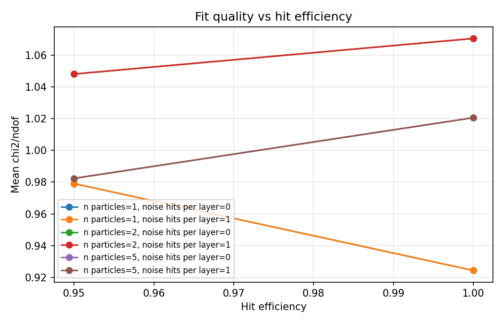
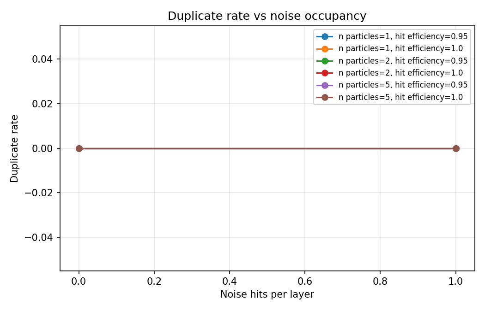
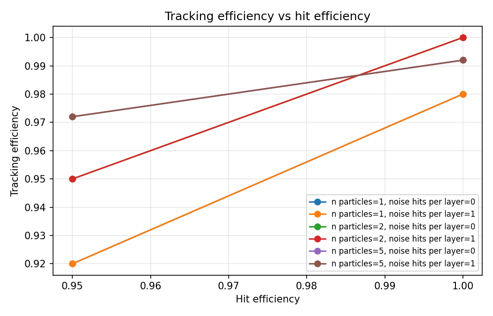
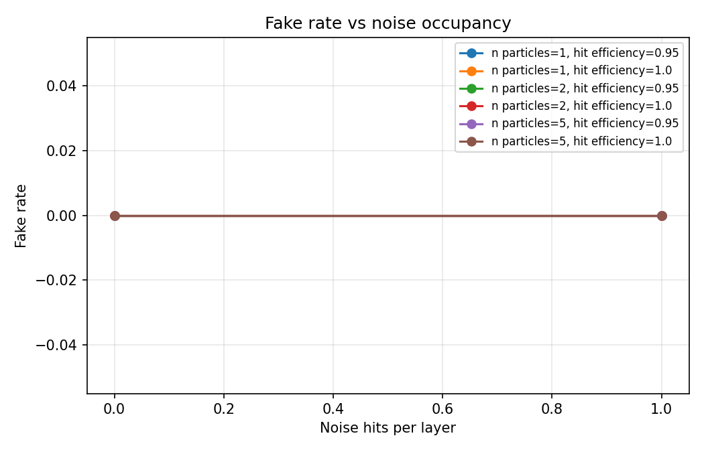
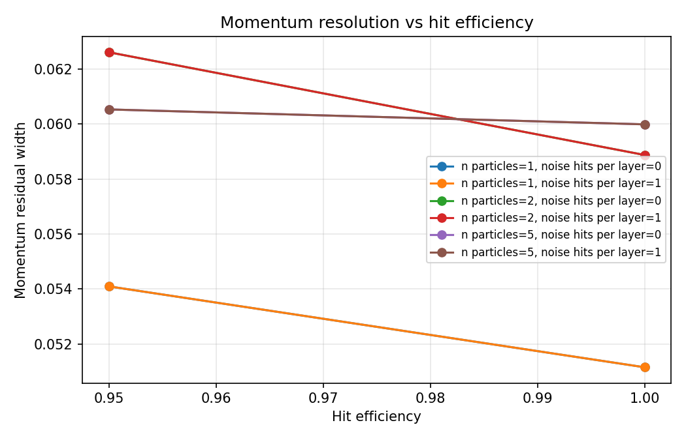
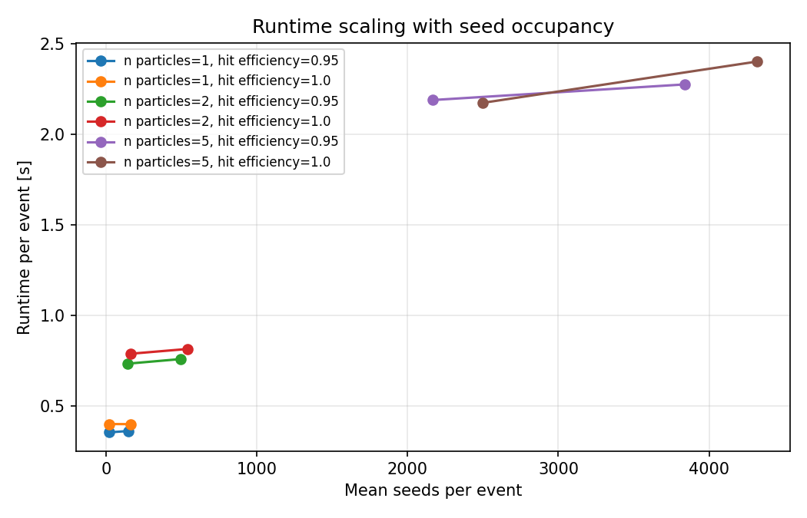

# OpenReco v2.2 Tracking Performance Analysis Report

## Purpose

OpenReco v2.2 uses the reconstruction chain as a controlled tracking-performance study tool.

The scan varies particle multiplicity, hit efficiency, and noise occupancy. It measures tracking efficiency, fake rate, duplicate rate, holes, fit quality, momentum residuals, covariance validity, and runtime.

## Main observations

- Best tracking efficiency: 1.0000 at `n=2, noise/layer=0, hit_eff=1.00`.
- Lowest tracking efficiency: 0.9200 at `n=1, noise/layer=0, hit_eff=0.95`.
- Widest momentum residual width: 0.0626 at `n=2, noise/layer=0, hit_eff=0.95`.
- Slowest runtime per event: 2.4039 s at `n=5, noise/layer=1, hit_eff=1.00`.

## Consolidated performance table

| n particles | noise/layer | hit efficiency | efficiency | fake rate | duplicate rate | holes/track | chi2/ndof | momentum residual std | runtime/event [s] |
|---:|---:|---:|---:|---:|---:|---:|---:|---:|---:|
| 1 | 0 | 0.95 | 0.9200 | 0.0000 | 0.0000 | 0.1739 | 0.9791 | 0.0541 | 0.3550 |
| 1 | 0 | 1.00 | 0.9800 | 0.0000 | 0.0000 | 0.0000 | 0.9244 | 0.0512 | 0.4011 |
| 1 | 1 | 0.95 | 0.9200 | 0.0000 | 0.0000 | 0.1739 | 0.9791 | 0.0541 | 0.3628 |
| 1 | 1 | 1.00 | 0.9800 | 0.0000 | 0.0000 | 0.0000 | 0.9244 | 0.0512 | 0.4005 |
| 2 | 0 | 0.95 | 0.9500 | 0.0000 | 0.0000 | 0.1939 | 1.0481 | 0.0626 | 0.7345 |
| 2 | 0 | 1.00 | 1.0000 | 0.0000 | 0.0000 | 0.0000 | 1.0705 | 0.0589 | 0.7893 |
| 2 | 1 | 0.95 | 0.9500 | 0.0000 | 0.0000 | 0.1939 | 1.0481 | 0.0626 | 0.7601 |
| 2 | 1 | 1.00 | 1.0000 | 0.0000 | 0.0000 | 0.0000 | 1.0705 | 0.0589 | 0.8158 |
| 5 | 0 | 0.95 | 0.9720 | 0.0000 | 0.0000 | 0.2500 | 0.9824 | 0.0605 | 2.1911 |
| 5 | 0 | 1.00 | 0.9920 | 0.0000 | 0.0000 | 0.0040 | 1.0206 | 0.0600 | 2.1758 |
| 5 | 1 | 0.95 | 0.9720 | 0.0000 | 0.0000 | 0.2500 | 0.9824 | 0.0605 | 2.2773 |
| 5 | 1 | 1.00 | 0.9920 | 0.0000 | 0.0000 | 0.0040 | 1.0206 | 0.0600 | 2.4039 |

## Figures

### chi2 vs hit efficiency

### duplicate rate vs noise

### efficiency vs hit efficiency

### fake rate vs noise

### momentum resolution vs hit efficiency

### runtime vs occupancy

## Interpretation

This v2.2 study shows that OpenReco can now produce reproducible tracking-performance evidence: a CSV summary, standard plots, and a Markdown report from the same controlled reconstruction scan.

The study is intentionally simplified. It is not detector-realistic yet. Its purpose is to isolate reconstruction behavior under controlled assumptions.
